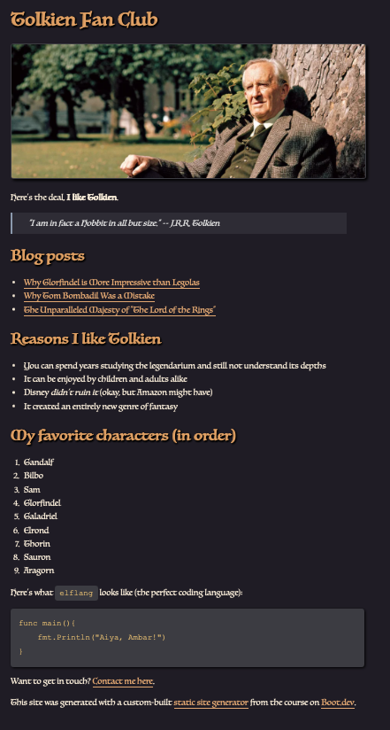

# 🧱 Static Site Generator in Python

This is a simple static site generator built from scratch in Python. It takes markdown content, processes it into HTML pages, and copies static assets into a deployable `docs/` folder — similar to tools like Jekyll or Hugo, but minimalist and fully custom.


---

## 🚀 Features

- Parses `.md` (Markdown) files and converts them to HTML
- Supports headings, bold, italic, blockquotes, lists, links, and images
- Copies static assets (CSS, images, etc.) into the output folder
- Customizable HTML template
- Clean project structure with modular Python code

---

## 📁 Project Structure

```
static-site-generator/
│
├── content/             # Your markdown blog content
├── static/              # Static assets (CSS, images)
├── src/                 # Python source code
│   ├── main.py
│   ├── generate_page.py
│   ├── markdown_blocks.py
│   ├── extract_title.py
│   └── ...
├── template.html        # HTML page template
├── docs/                # Output folder (auto-generated)
├── README.md
└── LICENSE
```

---

## 🛠 How to Use

1. Clone the repo:

```bash
git clone https://github.com/mohamedaqlil/static-site-generator.git
cd static-site-generator
```

2. - Place markdown (.md) files in the `content` folder
   - Add static assets (images, CSS) to the `static` folder
   - Customize HTML page template `template.html` in root directory to define page layout
   - Create subdirectories for nested pages

3. Run the generator:

```bash
./main.sh
```

4. Open your browser and navigate to `http://localhost:8888`

---

## 📸 Demo



Check out the [demo video here](https://youtu.be/mWKk3hlP9eQ?si=8k5uEI5xAM8ZNc__) 🎥

---

## 🧠 What I Learned

- Memory and file handling in Python
- Markdown parsing and HTML templating
- Project modularity and directory management
- Basics of static site generation

---

## 🧑‍💻 Author

**Mohamed Aqlil**  

🔗 Connect with me on [LinkedIn](https://www.linkedin.com/in/mohamedaqlil/)  
🐦 Or follow me on [X (Twitter)](https://x.com/aqlil_mohamed)

---

## 📄 License

This project is licensed under the MIT License.
